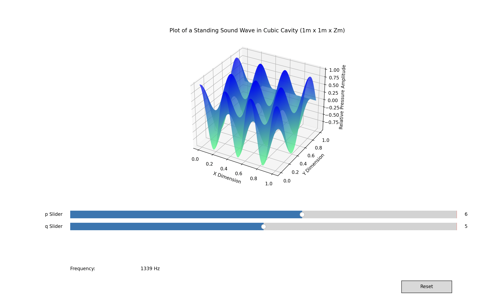

# Graphical Representation of a Standing Sound Wave in a Cavity
- We assume no excitation of modes in the z-direction (to preserve a three dimensional visual) by representing the pressure gradient as a level set (z = 0). 
- Sliders allow for adjustment of modes (p,q,r, assuming r = 0), modes take only integer values due to boundry conditions of resonate frequencies.
- Frequency measurement relates to the input/source signal. 
- Sliders occasionally need to be double clicked.

